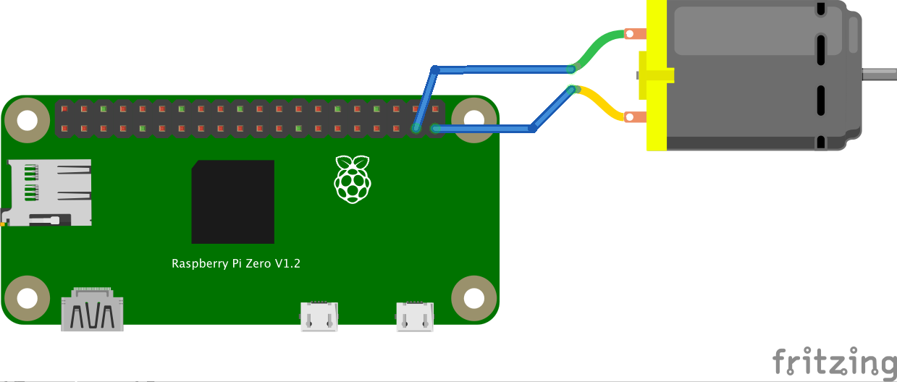

# リモートロック付きモーター制御

センサーは常時読み取り、モーター駆動だけをスマホWebAppからのロック状態で止めます。

## 配線

- GPIO 5（物理ピン29）: スイッチ（プルアップ、押すとLow）(任意)
- GPIO 26（物理ピン37）: モータードライバーの入力（ON/OFF）
- モーター本体はGPIOに直接つながず、トランジスタ / MOSFET / Hブリッジ経由で外部電源から駆動する

GPIO 26 が High のあいだモーターが回り、約800ms後に止まります。


## Raspberry Pi Zero 側

```bash
npm install
node --experimental-websocket main.js
```

Node.js v22以降では `--experimental-websocket` は不要です。

## スマホ / PC 側

`pc/index.html` をブラウザで開きます。同じチャンネル `chirimenLockMotor` に接続し、解除/ロックとモーター ON/OFF を送れます。スマホからのモーター操作はロック中でも動きます。
チャンネル名は各自変更してください

## メッセージ仕様

同じチャンネル内で `type` を分岐します。

| type | 方向 | 例 |
| --- | --- | --- |
| `lock` | 双方向 | `{ type: "lock", state: "UNLOCK" }` |
| `sync` | スマホ → Pi | `{ type: "sync" }` |
| `sensor` | Pi → スマホ | `{ type: "sensor", state: "ON" }` |
| `motor` | スマホ → Pi | `{ type: "motor", command: "ON" }` |
| `motor` | Pi → スマホ | `{ type: "motor", state: "ON" }` |

同僚のセンサー実装へ差し替える場合は、`main.js` のGPIOスイッチブロックだけを置き換え、`onSensorTriggered()` を呼んでください。
